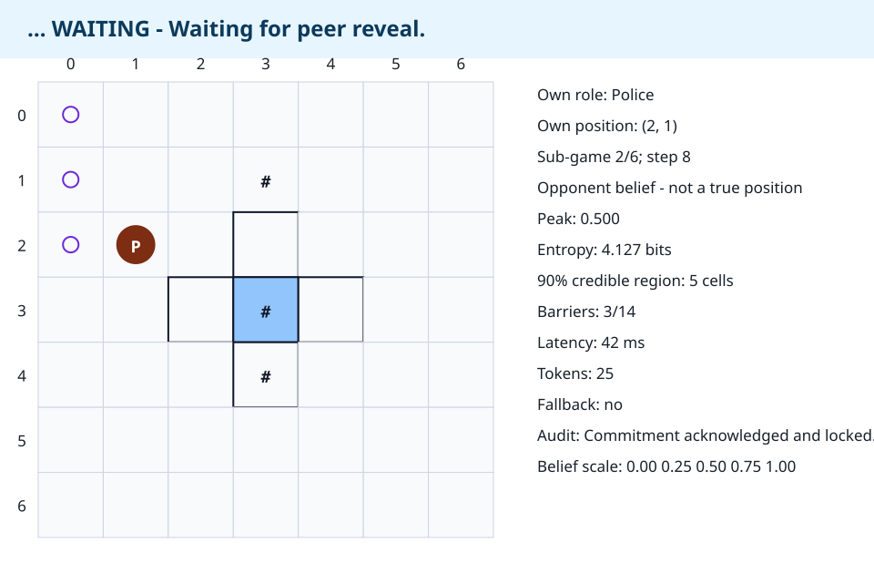

# Distributed Police-Thief P2P

Two autonomous, independently running Police and Thief peers compete over FastMCP
without a central game server or shared live state. Each peer owns only local truth,
uses SHA-256 Commit-Reveal for later audit, and exposes all business capabilities
through a typed `SimulationSdk`.

Status: package `0.11.0`. M11 quality/security gates and M12 experiment campaigns
are complete. M12 holdout promotion is **conditional** (one deadline miss;
Thief survival below 70%), and external public-tunnel verification remains open.
M13 packages two standalone role repositories with reciprocal links.

Sibling submission repositories:

- Police: https://github.com/JCS1029/GRP00001-police-p2p
- Thief: https://github.com/JCS1029/GRP00001-thief-p2p

Evidence: [`docs/evidence/M11_EXIT.md`](docs/evidence/M11_EXIT.md),
[`docs/evidence/M12_EXIT.md`](docs/evidence/M12_EXIT.md),
[`docs/evidence/M13_EXIT.md`](docs/evidence/M13_EXIT.md),
[`docs/TESTING.md`](docs/TESTING.md).

## Requirements

- Windows, Linux, or macOS.
- [`uv`](https://docs.astral.sh/uv/) `0.11.14`.
- CPython 3.13 or newer. The repository pins 3.13 for local development and tests
  Python 3.13/3.14 in CI.

Do not install dependencies with `pip`, `venv`, `virtualenv`, or `python -m`.

## Installation

```text
git clone https://github.com/Saed-Abdalgani/Final-project_police_thief_p2p.git
cd Final-project_police_thief_p2p
uv python install 3.13
uv sync --frozen --all-groups
```

Verify the foundation:

```text
uv run police-thief-p2p readiness
uv run ruff check .
uv run ruff format --check .
uv run mypy src tests scripts
uv run pytest
uv build
```

## Usage

The CLI adapter exposes readiness and a reporting dry run:

```text
uv run police-thief-p2p readiness
uv run police-thief-p2p readiness --json
uv run police-thief-p2p report validate \
  --manifest <artifact-root>/official/manifest_<game-id>.json \
  --artifact-root <artifact-root> \
  --sender <account@example.com>
```

Application adapters must call `SimulationSdk`; importing domain or service
implementations from CLI, GUI, MCP, or Gmail adapters is prohibited.

Run one peer with its private bind/root settings:

```text
uv run python -m police_thief_p2p.adapters.mcp.peer_process \
  --shared-config config/shared/game.example.json \
  --private-config config/private/game.example.toml
```

Run the two-process A-first/B-first interoperability campaign:

```text
uv run pytest tests/integration/test_dual_process_mcp.py -q
```

Run an offline tournament (never touch holdout without `--allow-holdout`):

```text
uv run python -m scripts.run_tournament --split validation --campaign-id demo
```

Launch the optional Tk live GUI when a display is available (deterministic demo feed):

```text
uv run python -m police_thief_p2p.adapters.gui
uv run python -m scripts.run_live_gui_demo
```

Headless screenshot evidence remains the submission default:

```text
uv run python scripts/generate_m10_screenshots.py
```

## Configuration

- `.env-example` documents local environment names without real secrets.
- Shared match rules use `config/shared/game.example.json` as the signed contract.
- Private peer settings use `config/private/game.example.toml`.
- Per-service external-call limits use `config/rate_limits.example.json`.
- Only declared secret references are resolved from environment variables; shared
  rules cannot be overridden by environment or private TOML.
- `.env`, OAuth files, tokens, keys, runtime logs, generated results, and temporary
  files are ignored by Git.

Appendix F status semantics, parser limits, canonicalization, provenance, schemas,
and examples are documented in [`docs/CONFIGURATION.md`](docs/CONFIGURATION.md) and
remain traceable through [`docs/TRACEABILITY.md`](docs/TRACEABILITY.md).

## Examples

Python callers use the SDK:

```python
from police_thief_p2p import SimulationSdk

report = SimulationSdk().check_readiness()
print(report.status.value)
```

No adapter may call an internal service directly.

Validate and merge configuration through the SDK:

```python
from pathlib import Path

from police_thief_p2p import SimulationSdk

effective = SimulationSdk().load_configuration(
    Path("config/shared/game.example.json").read_bytes(),
    Path("config/private/game.example.toml").read_bytes(),
    submission_mode=True,
)
print(effective.shared.digest())
```

Create and transition local game state through the SDK:

```python
from police_thief_p2p.sdk import Action, Role

state = SimulationSdk().create_local_game(effective.shared, Role.POLICE)
next_state = SimulationSdk().apply_action(state, Action.stay()).state
print(next_state.step_number)
```

Domain mechanics, scoring, privacy boundaries, and evidence are documented in
[`docs/DOMAIN.md`](docs/DOMAIN.md).

The exact FastMCP inventory, envelopes, proposal fields, phases, idempotency
algorithm, error codes, retry policy, examples, and interoperability checklist are
documented in [`docs/PROTOCOL.md`](docs/PROTOCOL.md).

Commitment bytes, nonce lifecycle, signed declarations, evidence chaining,
failure sanctions, replay order, and mutual result agreement are documented in
[`docs/CRYPTO_AUDIT.md`](docs/CRYPTO_AUDIT.md).

Competitive feature objectives, plugin safety, search, opponent adaptation, hint
policy, reproducibility, and evidence are documented in
[`docs/STRATEGY.md`](docs/STRATEGY.md). Startup, deadlines, retries, health,
recovery, tunnel preflight, backpressure, and shutdown are documented in
[`docs/OPERATIONS.md`](docs/OPERATIONS.md).

Artifact filenames, immutable digest graph, exact score/token accounting,
verified-only report construction, OAuth/outbox transitions, and Gatekeeper
controls are frozen in
[`docs/PRD_REPORTING_UI_REPLAY.md`](docs/PRD_REPORTING_UI_REPLAY.md).

## Live local-truth GUI and replay

The optional Tk live application consumes only immutable `LocalView` snapshots.
It shows own truth, public barriers/trail, normalized opponent belief and
uncertainty, hints, lifecycle state, and safe metrics. Opponent true position,
opponent track, nonces, credentials, and replay-derived truth cannot be
represented by the DTO. Gameplay remains in a background worker; the Tk event
loop receives only bounded, coalescible visual snapshots.

Verify one manifest-linked finalized sub-game and export both audit formats:

```text
uv run police-thief-p2p replay verify \
  --manifest <artifact-root>/official/manifest_<game-id>.json \
  --artifact-root <artifact-root> \
  --group GRP00001 \
  --sub-game 1 \
  --json-report replay-audit.json \
  --html-report replay-audit.html
```

Exit `0` means `Verified OK`, exit `3` means `TAMPERED`, and exit `2` means the
input failed schema/linkage admission. Single-log replay shows the selected
local track and belief. Objective Police-and-Thief tracks unlock only through
the SDK dual-log method after both final logs pass audit and linkage.

Reproduce the deterministic submission evidence with:

```text
uv run python scripts/generate_m10_screenshots.py
```







## Development

Use test-driven changes and keep public behavior linked to requirement IDs:

```text
uv sync --frozen --all-groups
uv run pre-commit run --all-files
uv run pytest
```

The complete test strategy, markers, and clean-clone sequence are in
[`docs/TESTING.md`](docs/TESTING.md). Architecture and security decisions are in
[`docs/PLAN.md`](docs/PLAN.md), [`docs/DECISIONS.md`](docs/DECISIONS.md), and
[`docs/SECURITY.md`](docs/SECURITY.md).

## Academic model

### Dec-POMDP view

Each peer is a Dec-POMDP agent. The local state is own position, public barriers,
remaining barrier budget, step index, and terminal flags. Actions are the legal
move/stay set plus optional barrier placement. Transitions are the deterministic
shared engine. Rewards are the official fixed scoring rules, not a private
shaping signal. Observations are delayed/lossy scent frames and natural-language
hints. Uncertainty is a belief distribution over the opponent cell with learned
hint reliability; live objective opponent truth is forbidden.

### FastMCP orchestration

Peers negotiate and play only through versioned FastMCP tools. A typed state
machine owns phases; at-least-once delivery with exactly-once effects is enforced
by idempotent message IDs. Every outbound dependency call (MCP, language, email,
tunnel health) passes the Gatekeeper for timeouts, retries, 429/backoff, and
circuit breaking. Failures are typed and fail closed.

### Belief, strategy, and language boundary

Belief fuses motion mixtures with scent likelihoods and capped hint evidence.
Police search combines capture, distance, cut, information, and risk terms;
Thief search combines survival, routes, space, scent leakage, and risk. Barriers
are graph cuts under the shared quota. Hints follow a private honesty cadence;
optional LLM paraphrasing is Gatekeeper-bound and always degrades to the
deterministic template. See [`docs/STRATEGY.md`](docs/STRATEGY.md).

### Experiments

Methodology and holdout procedure are in
[`docs/RESEARCH_REPORT.md`](docs/RESEARCH_REPORT.md). Machine-readable results:

- [`results/benchmarks/m12_tuning.json`](results/benchmarks/m12_tuning.json)
- [`results/benchmarks/m12_selection.json`](results/benchmarks/m12_selection.json)
- [`results/benchmarks/m12_language.json`](results/benchmarks/m12_language.json)
- [`results/benchmarks/m12_league_rehearsal.json`](results/benchmarks/m12_league_rehearsal.json)

Holdout score share was about `65.4%` with failures `R02-DEADLINE` and
`S03-THIEF`; validation and overfitting gates passed.

## Troubleshooting

- **Wrong Python selected:** run `uv python install 3.13` and `uv sync --reinstall`.
- **Lockfile mismatch:** do not edit `uv.lock`; use `uv add`, `uv remove`, or
  `uv lock`, then review the diff.
- **Readiness command fails:** run `uv run python scripts/validate_structure.py`
  and inspect the returned missing path.
- **Peer does not become ready:** verify the configured port is free and call
  `health_v1` at the streamable-HTTP `/mcp` endpoint; startup retries are bounded.
- **Tunnel preflight fails:** confirm `health_url` matches the public/streamable
  endpoint, reject query-bearing tunnel URLs, and re-run bidirectional probes.
- **Negotiation is refused:** compare exact shared-file bytes first, then
  `config_sha256`, scent digest/vector, protocol/schema, group IDs, commits, URLs,
  counted ledger, game UUID, and role schedule in that order.
- **Sequence/conflict error:** retry the exact original envelope and message ID;
  never construct new bytes for an uncertain mutation.
- **Audit / mutual agree fails:** preserve both artifact roots; compare manifest
  digests and audit reports; do not reseal evidence.
- **OAuth / Gmail:** use send-only scopes from `.env-example`; never commit token
  files. A pending outbox item retries under Gatekeeper limits until accepted or
  permanently failed.
- **HTTP 429:** wait at least configured backoff and any `Retry-After`; do not
  open a parallel client that bypasses the Gatekeeper.
- **Secret scanner flags a value:** remove/rotate the value. Do not suppress a real
  credential in a baseline.
- **Tk unavailable:** headless operation remains the required functional path.
  Use the replay CLI and SVG generator for deterministic headless evidence.
- **Replay says `TAMPERED`:** inspect the first finding and preserve the original
  files. Never edit/reseal official evidence to make replay pass.

## Contribution Rules

1. Start from the current canonical branch and use a focused review branch.
2. Update the owning PRD/ADR before changing public protocol, schema, config, or SDK
   behavior.
3. Add tests for happy, edge, invalid, and dependency-failure paths.
4. Preserve SDK-only access, Gatekeeper routing, local truth, and no shared state.
5. Run the complete foundation command suite before review.
6. Never commit generated results or secrets.

## Security

Treat all remote input as hostile. Report vulnerabilities privately to the project
team; do not open an issue containing tokens, opponent private state, nonces, or
exploitable league details. See [`docs/SECURITY.md`](docs/SECURITY.md).

## Credits and Reference Use

Attribution and the reference-code policy are recorded in
[`CREDITS.md`](CREDITS.md). The public example repository is informative only and
does not override the supplied rules book.

## License

Project-owned code is released under the MIT License. Third-party material retains
its original license and attribution.
