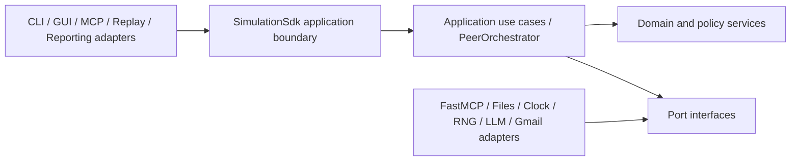

# Architecture Decision Register

**Baseline:** `1.0.0`
**Status vocabulary:** Proposed, Accepted, Superseded, Rejected.

## 1. Index

| ADR | Decision | Status | Date | Owners |
|---|---|---|---|---|
| ADR-001 | SDK-only access to business logic | Accepted | 2026-07-25 | Architecture, QA |
| ADR-002 | Ports-and-adapters architecture | Accepted | 2026-07-25 | Architecture |
| ADR-003 | Canonical workspace exporting two standalone role repositories | Accepted | 2026-07-25 | Architecture, Release |
| ADR-004 | Canonical JSON and SHA-256 commitment bytes | Accepted | 2026-07-25 | Protocol, Security |
| ADR-005 | At-least-once delivery with exactly-once application effects | Accepted | 2026-07-25 | Protocol, Reliability |

## 2. ADR template

```text
## ADR-NNN - Title
Status:
Date:
Owners:
Requirement links:
Source links:

### Context
### Decision drivers
### Options considered
### Decision
### Consequences
### Security and privacy impact
### Verification
### Rollback / supersession
```

## ADR-001 - SDK-only access to business logic

**Status:** Accepted
**Date:** 2026-07-25
**Requirements:** FR-SDK-001..008, NFR-REL-006, NFR-MNT-002, NFR-MNT-006

### Context

Multiple entry points are required: headless runner, GUI, FastMCP handlers, replay verifier, tournament tooling, and reporting. Direct service access would duplicate policy and permit adapters to bypass validation or local-truth controls.

### Options considered

1. Let each adapter call domain services.
2. Put all logic in the Orchestrator.
3. Expose typed use cases through a versioned SDK facade while injecting ports.

### Decision

All business capabilities are invoked through `SimulationSdk`. Adapters translate input/output only. The SDK coordinates approved application use cases, returns typed results/errors, and accepts injected ports. Domain services remain independently testable and contain domain logic; the SDK does not become a monolith.

### Consequences

- One enforceable boundary for auth, validation, lifecycle, and local truth.
- Headless and GUI behavior stays identical.
- Public API compatibility must be versioned and tested.
- Adapters require integration tests proving they cannot bypass the SDK.

### Verification

Dependency tests, forbidden-import checks, SDK contract tests, public-method tests, and architecture review.

## ADR-002 - Ports-and-adapters architecture

**Status:** Accepted
**Date:** 2026-07-25
**Requirements:** FR-SDK-006, FR-ORC-002, NFR-MNT-002, NFR-MNT-006, NFR-MNT-007

### Context

Core game, belief, strategy, and cryptographic behavior must remain deterministic and testable while transport, files, clocks, GUI, LLMs, tunnels, system inspection, and Gmail are failure-prone external concerns.

### Decision

Dependencies point inward:



Domain modules import only domain/shared abstractions. Concrete adapters depend on ports; ports never depend on adapters. External calls pass through the Gatekeeper port where applicable.

### Consequences

- Deterministic in-memory tests and fault injection become straightforward.
- More interfaces and DTOs must be maintained.
- Architecture checks must prevent back imports and logic in controllers.

### Verification

Import-linter rules, dependency graph review, fake adapters, contract tests, and source-size/single-responsibility checks.

## ADR-003 - Two standalone exported role repositories

**Status:** Accepted
**Date:** 2026-07-25
**Requirements:** FR-LGE-007..010, Appendix E rules 49-50

### Context

The submission requires separate Police and Thief repositories. Developing two copies from day one creates protocol and security drift; sharing a live package or filesystem at league time violates isolation.

### Options considered

1. Develop independently in two repositories.
2. Use one repository at runtime for both roles.
3. Develop one canonical workspace, then deterministically export two independently installable snapshots.

### Decision

Use option 3. The canonical workspace owns source, schemas, conformance vectors, and docs. A reviewed export manifest selects common and role-specific files. Each output gets its own lockfile, profile, README, tests, sibling link, history/tag, and no runtime dependency on the canonical workspace or other role.

### Consequences

- Minimizes design drift and maximizes cross-role conformance.
- Export tooling and manifests become release-critical.
- Both exports require independent clean-clone, secret, link, and compatibility tests.
- Any post-export patch must return to canonical source and regenerate both outputs.

### Verification

Manifest digests, clean-clone runs, disconnected-filesystem test, reciprocal links, and cross-version protocol matrix.

## ADR-004 - Canonical JSON and SHA-256

**Status:** Accepted
**Date:** 2026-07-25
**Requirements:** FR-CFG-010, FR-CRY-001..015, NFR-SEC-003, NFR-SEC-010

### Context

Commit-Reveal fails if peers serialize equivalent data into different bytes. String concatenation is ambiguous and vulnerable to field substitution.

### Decision

- Payloads conform to a versioned schema and include a `schema_version`.
- Strings are Unicode NFC and encoded as UTF-8.
- Object keys are sorted lexicographically by Unicode code point.
- JSON uses separators `,` and `:` with no insignificant whitespace.
- Arrays preserve schema-defined order.
- Booleans and null use JSON literals.
- Non-finite numbers are rejected. Integer fields serialize as decimal integers; non-integer fields must use schema-defined decimal-string encoding rather than runtime float formatting.
- The fresh nonce is a canonical payload field for hash calculation but remains locally secret until final audit.
- SHA-256 hashes the exact canonical byte sequence and digests are lowercase hex in envelopes.
- Digest comparisons use constant-time comparison.

Illustrative numeric values elsewhere in the PDF do not alter Appendix F. Appendix F values populate schema defaults; legal negotiated changes are signed in `game.json`.

### Consequences

Golden vectors are mandatory across both repositories. Schema changes require a protocol/config version bump and compatibility decision.

### Verification

Exact byte fixtures, cross-process/cross-platform vectors, Unicode cases, reordered-key cases, non-finite rejection, mutation tests, and independent replay verification.

## ADR-005 - At-least-once delivery, exactly-once effects

**Status:** Accepted
**Date:** 2026-07-25
**Requirements:** FR-NEG-012, FR-MCP-005..012, FR-ORC-006..012, NFR-REL-001..004, NFR-REL-007

### Context

Public networks can lose responses after applying requests. Blind retry can duplicate a move or barrier; avoiding retries makes recoverable loss terminal.

### Decision

Transport may retry within bounded deadlines, so delivery is at least once. Every mutating request carries stable game, phase, sequence, sender, message, correlation, and payload-digest identity. Before mutation, the receiver checks an atomic idempotency record:

- unseen identity + valid phase: apply once, persist effect and response atomically;
- same identity + same digest: return the persisted response;
- same identity + different digest: tamper/protocol violation;
- future/out-of-window sequence: reject or bounded-buffer according to the protocol mechanism PRD;
- stale sequence: return prior result only when identity/digest match.

Recovery resumes only at a mutually acknowledged durable checkpoint. It never fabricates acknowledgement or replays a possibly applied non-idempotent action.

### Consequences

Storage and state transition ordering are part of protocol correctness. Idempotency records must outlive retry windows and official audit evidence must preserve conflicts.

### Verification

Loss-after-apply, duplicate, reordering, reconnect, crash-at-boundary, digest-conflict, deadline, and bounded-queue fault tests.

