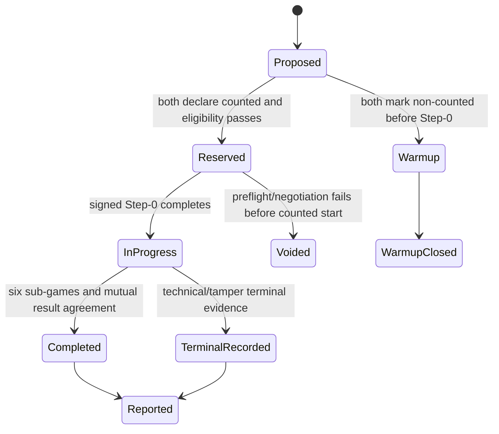

# Engineering and Competition Governance

**Baseline:** `1.0.0`
**Applies to:** canonical workspace, Police export, Thief export, match operations, experiments, and submission evidence.

## 1. Controlled vocabulary

| Term | Controlled meaning | Do not use as |
|---|---|---|
| Peer | One independently running role process that owns one role's local truth, exposes one MCP server, and uses one MCP client. | A thread, UI window, or shared in-process object |
| Group | The registered student team identified by one eight-character group ID and responsible for both role repositories. | A peer or a match |
| Role | `POLICE` or `THIEF`, determining legal actions, private state, scoring perspective, and strategy profile for one sub-game. | A permanent repository-wide claim that bypasses the signed schedule |
| Series | One scored encounter between two groups consisting of exactly six sub-games under one agreed series identity. | A single sub-game |
| Sub-game | One role assignment and complete protocol lifecycle ending in capture, survival, technical result, or tamper result. | A network request or turn |
| Turn | The ordered Police-plus-Thief action cycle used for phase, scent-decay, and timeout accounting. | An arbitrary UI refresh |
| Step | A protocol-indexed action opportunity inside a sub-game. | A wall-clock timestamp |
| Local truth | State a peer is legitimately entitled to know live: its own true state, public barriers/events, negotiated terms, received messages, and its derived opponent belief. | A reconstructed objective board |
| Objective state | Post-audit reconstruction containing both true histories and all verified reveals. It is unavailable to live policy/UI. | A live source of strategy features |
| Counted match | A mutually declared scored series that consumes league limits and is recorded exactly once per opponent. | A warmup or failed preflight |
| Warmup | An explicitly non-counted interoperability run agreed as such before Step-0. | A way to relabel an unfavorable completed counted match |
| Constitution | The byte-identical, signed shared `config/game.json` and referenced schema/version set. | Private TOML settings |
| Commitment | SHA-256 digest of versioned canonical payload bytes containing a fresh secret nonce. | A plaintext action |
| Technical loss | A non-tamper terminal failure assigned according to agreed protocol and league rules. | Invalid input or cryptographic fraud |
| Tamper forfeit | A terminal integrity outcome caused by commitment, declaration, result, or audit mismatch. | A transient transport error |

## 2. Stakeholders and RACI

Roles may be held by the same person on a small team, but the responsibilities remain distinct. A person shall perform a second-pass review when acting in multiple roles.

| Deliverable / decision | Product / Submission Owner | Architecture Lead | Protocol Lead | Strategy Lead | QA Lead | Security Lead | Operations / Release Lead |
|---|---|---|---|---|---|---|---|
| PRD and source interpretation | A | R | C | C | C | C | I |
| Architecture and SDK boundaries | C | A/R | C | C | C | C | I |
| Shared config/protocol/schema change | C | A | R | C | C | C | I |
| Physics/scoring change | A | C | R | C | R | C | I |
| Strategy policy/tuning | I | C | C | A/R | C | C | I |
| Test plan and release evidence | I | C | C | C | A/R | C | C |
| Threat model and secret controls | I | C | C | C | C | A/R | C |
| Public tunnel/runbook/release | I | C | C | I | C | C | A/R |
| Counted-match declaration | A | I | C | I | C | C | R |
| Final submission package | A/R | C | C | C | C | C | R |
| Readiness decision | A | C | C | C | R | R | R |

`R` = responsible, `A` = accountable, `C` = consulted, `I` = informed. No P0 release gate is self-approved without a documented second-pass review.

## 3. Change control

### 3.1 Controlled artifacts

The following are compatibility contracts:

- public SDK surface;
- protocol envelopes, MCP tool names, request/response/error schemas;
- canonicalization rules and commitment payloads;
- shared config keys/default/status semantics;
- artifact schemas and filename rules;
- state-machine phases and terminal outcomes;
- scent kernel/model and signed numeric example;
- role export manifest and cross-repository compatibility matrix.

### 3.2 Required workflow

1. Open a change record or ADR with motivation, affected requirement/rule/parameter IDs, compatibility impact, security impact, migration, and rollback.
2. Update the owning mechanism PRD first.
3. Select a version bump:
   - patch: clarification or backward-compatible implementation fix with unchanged bytes/contracts;
   - minor: backward-compatible additive field/capability that old peers can safely ignore or negotiate away;
   - major: any incompatible byte, schema, phase, semantic, or removal change.
4. Update golden vectors, schemas, PRD, PLAN, TODO, tests, protocol/config compatibility tables, and both export manifests in one review.
5. Obtain Architecture approval plus Protocol approval; Security approval is mandatory for crypto, identity, remote input, secrets, reporting, or privacy; QA signs evidence.
6. Run cross-version and downgrade/fail-closed tests.
7. Record the change in `CHANGELOG.md` and release both roles from the same canonical revision.

No private TOML, environment variable, or local flag may override shared terms. A capability is active only when both peers explicitly negotiate the same compatible version and value.

## 4. Violation and outcome taxonomy

| Class | Meaning | Examples | Immediate handling | Competitive effect |
|---|---|---|---|---|
| `INVALID_INPUT` | Untrusted data fails syntax, schema, identity, range, sequence, phase, or legal-action validation before a valid effect. | diagonal move, unknown key, oversized request, wrong game ID | Reject safely; no state mutation; redacted diagnostic | Retry only if protocol permits; repeated abuse can escalate |
| `TECHNICAL_LOSS` | A peer cannot complete required behavior without evidence of deliberate integrity manipulation. | deadline exhaustion, unrecoverable tunnel/process failure, missing required artifact | Enter immutable technical terminal state; preserve evidence | Fixed technical-loss score from Appendix F |
| `TAMPER_FORFEIT` | Signed/committed evidence is inconsistent, substituted, reordered, falsified, or improperly revealed. | digest mismatch, false capture response, changed declaration, reused identity with different payload | Stop normal scoring; preserve both claims and audit proof | Tamper sanction/zero as mandated; do not relabel technical |
| `PROJECT_DISQUALIFICATION` | Project/submission violates a competition-level mandatory rule. | committed credentials, shared live state, false counted-match declaration, prohibited submission structure | Stop release/submission; notify accountable owner | Not locally recoverable as a normal game result |

Mapping to Appendix E: rules 1-20 and 46-48 are runtime compliance; 21-22 and 36-38 define truth/audit/tamper behavior; 39-45 and 49-55 include repository, submission, league, and project-level sanctions. Exact sanctions remain controlled by the book and lecturer; software records facts and typed local outcomes without inventing authority.

## 5. Data classification

| Class | Examples | Live access | Storage / transport control | Logging |
|---|---|---|---|---|
| `PUBLIC` | repository URLs, protocol versions, public tunnel endpoint, documented defaults | Both peers/operator | Integrity validation; TLS/public transport as available | Allowed |
| `SHARED_SIGNED` | `game.json`, declarations after allowed disclosure, public barriers, commitments, agreed result | Both peers according to phase | Canonical bytes, digests, schema validation, append-only evidence | Allowed with correlation and digest |
| `LOCAL_PRIVATE` | own position/history, own policy features, pre-audit full local log, opponent belief | Owning peer and authorized local operator only | Process isolation, restricted artifact root, no remote disclosure except protocol fields | Redacted summaries only |
| `SECRET` | commitment nonces before audit, OAuth tokens, credentials, API keys, private keys, `.env` values | Minimum required local component | Environment/protected local file, never repository, strict permissions, rotation | Never |
| `POST_AUDIT_EVIDENCE` | verified full logs, revealed nonces, objective replay track, audit findings | Both groups/authorized reviewers after phase gate | Immutable artifact linkage, checksums, access control, retention lock | Digest/status; raw evidence kept out of operational logs |

Classification is field-level. A public container does not make embedded local-private or secret data public.

## 6. Retention and disposal

| Record | Minimum retention | Disposal / expiry | Rationale |
|---|---|---|---|
| Operational diagnostics | 30 days after series or until incident closure, whichever is later | Secure deletion from local operational store; retain aggregated metrics | Troubleshooting without indefinite private-data growth |
| Official declarations/configs/logs/results/audit manifests | Through grading/appeal window plus 90 days; repository artifacts retained per submission rules | Archive immutable evidence; delete local duplicates after verified backup | Reproducibility and dispute handling |
| Commitment nonces | Secret until final audit; retain only inside official post-audit evidence through appeal window | Securely delete working copies immediately after finalized artifact verification | Prevent premature reveal and unnecessary secret copies |
| OAuth `credentials.json` / `token.json` | Only while reporting integration is authorized | Revoke provider token, securely delete local files on rotation, member departure, or project end | Least privilege |
| Tournament/experiment outputs | Through final report and grading/appeal window | Archive manifests/results; delete unneeded raw telemetry containing private data | Reproducibility |
| Counted-match ledger | Through final submission and appeal window | Archive signed/exported ledger with submission evidence | Prevent duplicate/opponent-count disputes |
| Security incident evidence | Until incident and appeal closure, subject to least-access | Controlled deletion approved by Security Lead | Forensics |

Backups inherit classification and expiry. Disposal must not remove evidence under active audit, grading, appeal, or security hold.

## 7. Standalone architecture invariants

### 7.1 INV-LOCAL-TRUTH

During a live sub-game, a peer may hold only:

- its own true position/action history and private policy state;
- negotiated public terms and public barrier history;
- messages legally received by phase;
- opponent scent observations and natural-language hints;
- a derived probability distribution over opponent locations.

Forbidden live fields include `opponent_true_position`, `objective_board`, `other_peer_private_log`, `future_reveal`, and any replay-derived truth. Enforcement:

- local-view DTOs omit forbidden fields by construction;
- live domain state has no two-truth aggregate type;
- serializers use explicit allowlists;
- GUI and strategy accept local-view DTOs only;
- privacy tests scan DTOs, logs, prompts, screenshots, exceptions, and MCP payloads;
- objective reconstruction exists only in the post-audit replay package.

### 7.2 INV-NO-SHARED-LIVE-STATE

Peers communicate only through versioned MCP messages over configured endpoints and exchange files/artifacts only at defined protocol or audit phases.

| Permitted | Prohibited |
|---|---|
| Separate processes, artifact roots, configs, ports, and repositories | Shared memory, in-process object references, common writable database, common mutable file, IPC backchannel |
| Signed configuration copied independently to each peer | Reading the opponent's private TOML, logs, environment, or filesystem |
| Public barriers, commitments, allowed reveals, status, audit and result messages | Debug endpoint/objective board that reveals hidden state |
| Post-audit exchange of finalized evidence | Live replay feed into strategy or GUI |
| Offline shared development source before role export | Runtime import or editable install from the sibling/canonical repository |

Development integration tests may launch both peers from one test command only when they remain separate OS processes with isolated roots and communicate through the same protocol boundary used remotely.

## 8. Academic integrity and reference-code policy

- The public example repository is a learning reference, not the submission architecture.
- Ideas, public interfaces, or minimal fragments may be reused only when license terms permit, provenance is recorded, and the result is independently reviewed and tested.
- No member or AI agent may present copied reference logic, generated material, experimental results, screenshots, or prose as original without disclosure required by course policy.
- All external code/assets/data must appear in `CREDITS.md` with source URL, revision, license, files/ideas used, and modifications.
- Experiment results must be real, reproducible, and linked to immutable manifests. Fabricated, cherry-picked, or relabeled runs are prohibited.
- The submitted team remains responsible for understanding and defending every line, design, and conclusion.

## 9. Two-repository release policy

| Item | Policy |
|---|---|
| Names | `<group-id>-police-p2p` and `<group-id>-thief-p2p` unless lecturer naming overrides |
| Source branch | Protected `main`; reviewed short-lived branches; no direct unreviewed release edits |
| Export | Deterministic manifest from one frozen canonical commit; no runtime linkage to canonical/sibling tree |
| Version | Matching package/protocol/config/schema compatibility matrix in both repositories |
| Tag | Final annotated `v1.0-submission` after independent clean-clone verification |
| Access | Lecturer has verified access before tag; secrets never used as access mechanism |
| Cross-links | Each README links exact sibling repository and release tag |
| Drift | Changes return to canonical workspace, tests run, and both exports regenerate |
| Verification | `uv sync`, tests, lint, coverage, headless sample, replay verification, secret scan, link check in each clean clone |

## 10. Counted-match ledger policy

States:

Each entry records `game_uid`, local/remote group IDs, opponent identity, counted flag, warmup reason, reservation time, signed declarations, both played commits, six-game schedule, status, result digest, report IDs, and audit references.

Rules:

- Counted status is agreed before Step-0 and cannot be changed because of outcome.
- A group/opponent pair may have at most one completed or terminal counted series.
- Warmups never increment totals and cannot use a previously completed result as a retroactive count.
- Failed config/connectivity negotiation before signed Step-0 is void and does not consume a count.
- Totals are computed from immutable ledger entries, not operator input.
- Conflicting remote declaration blocks start and produces evidence.
- Ten-match maximum and two-distinct-opponent minimum are enforced.

## 11. Readiness decision rubric

The final line is exactly one of:

- `READY`: every mandatory rule, P0 task, acceptance criterion, release gate, two-role clean-clone check, security control, and evidence item passes; no unresolved P0/P1 release blocker or waived integrity defect.
- `CONDITIONALLY READY`: no integrity, secrecy, scoring, isolation, or submission-disqualification blocker exists, but one or more explicitly owned, dated, non-competition-critical conditions remain. Conditions and fallback must be listed.
- `NOT READY`: any mandatory rule, P0 requirement, SDK/Gatekeeper boundary, protocol integrity, test/coverage, Ruff, secret safety, `uv`, repository, public-tunnel, reporting, or submission gate fails or lacks evidence.

The audit checklist must report documentation completeness, architecture, SDK-only access, Gatekeeper coverage, duplication/modularity/file sizes, tests and >=85% coverage, Ruff zero, config/secrets, `uv`, README, experiments/results/costs, UI/UX/accessibility, Git/license/credits, deployment, league eligibility, and submission package. Missing evidence is a failure, not a pass.

