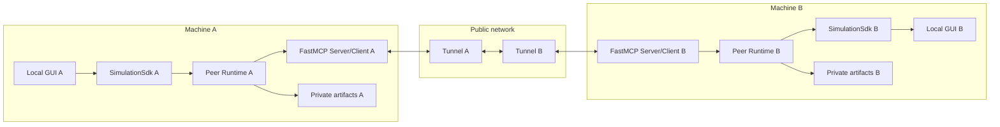
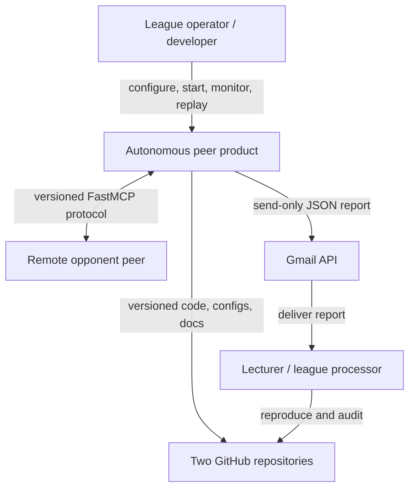
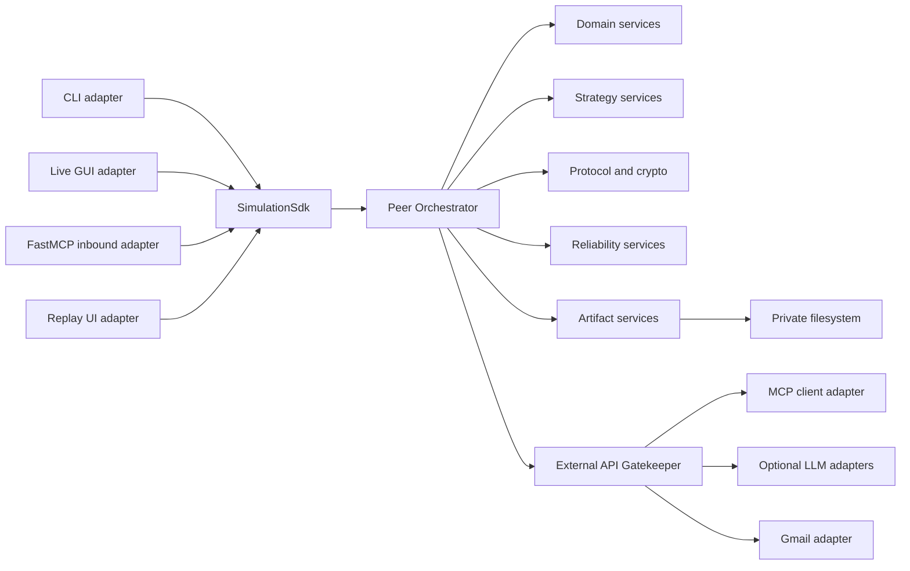
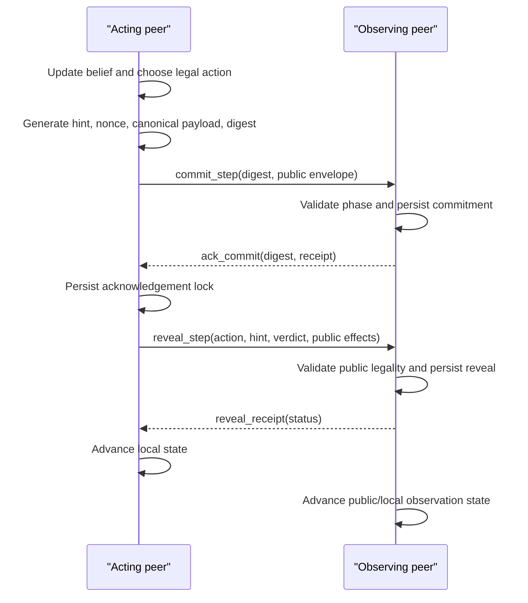
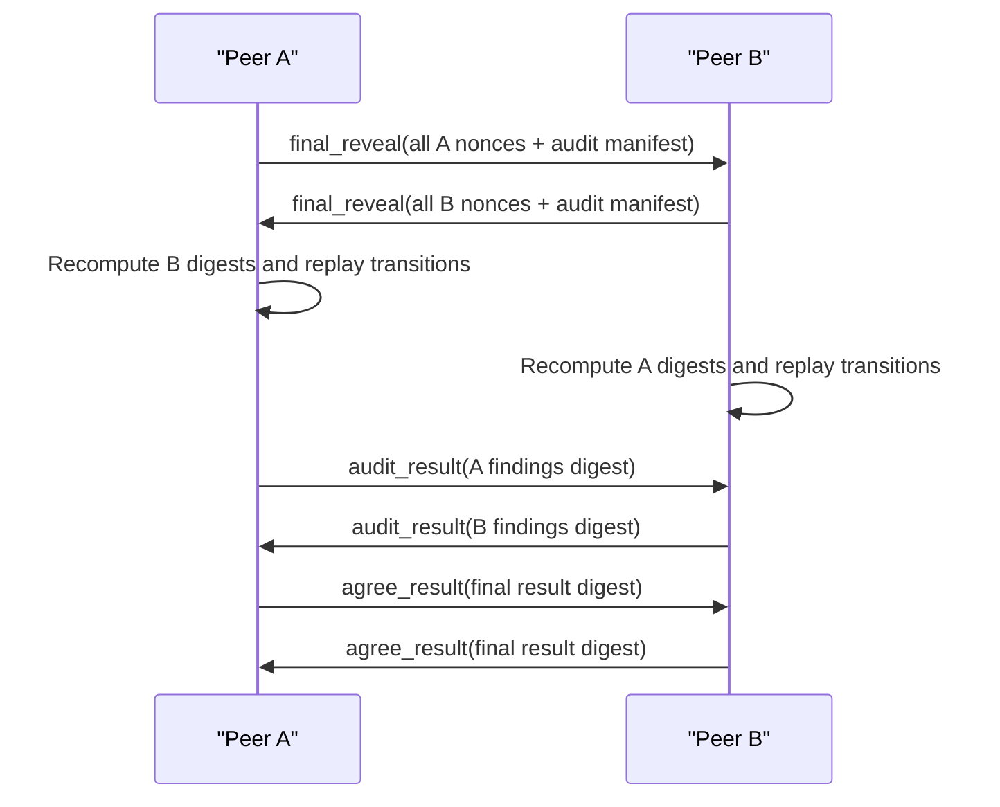
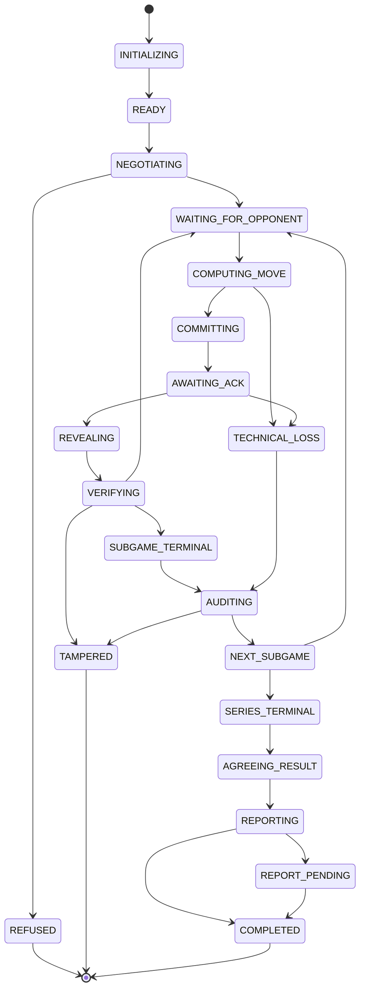

# Architecture and Project Plan

## Distributed Cops-and-Robbers over a Peer-to-Peer Network

| Field | Value |
|---|---|
| Plan status | Implementation baseline |
| Version | 1.0.0 |
| Date | 2026-07-25 |
| Requirements source | `docs/PRD.md` |
| Execution source | `docs/TODO.md` |
| Architecture style | SDK-first, ports-and-adapters, event-driven peer runtime |
| Delivery model | Incremental, test-first, two independently deployable repositories |

## 1. Plan objective

Build a league-winning distributed system in which operational correctness is non-negotiable and competitive intelligence is measurable. The implementation sequence deliberately removes technical-loss risks before spending effort on sophisticated strategy.

The plan has three tracks that converge at each milestone:

1. **Compliance and integrity** - exact rules, configuration, cryptography, audit, artifacts, security, and submission.
2. **Distributed product engineering** - SDK boundaries, MCP interoperability, state machine, resilience, observability, GUI, replay, reporting, and deployment.
3. **Competitive intelligence** - belief estimation, Police interception/barriers, Thief survival/deception, opponent modeling, self-play, tuning, and holdout evaluation.

No track may bypass its exit gates. A stronger strategy cannot compensate for a technical loss, and a flawless protocol cannot win the league with the reference greedy policy.

## 2. Guiding principles

1. **Local truth by construction**: a live object capable of exposing both true positions will not exist.
2. **SDK is the product boundary**: every entry point uses the SDK.
3. **Orchestrator coordinates, services decide**: no business logic in CLI, GUI, MCP handlers, or route code.
4. **Gate every external call**: MCP, Gmail, and optional remote LLM calls pass through the central Gatekeeper.
5. **Fail closed on integrity, degrade gracefully on optional capability**.
6. **Persist before acknowledgement** for mutating protocol operations.
7. **Canonical bytes before hashes**: no ad hoc string concatenation.
8. **At-least-once delivery, exactly-once effects** through message IDs and idempotency.
9. **Determinism is a feature**: seeds, clocks, configs, versions, and results are recorded.
10. **Algorithm before LLM**: movement is deterministic Python by default; LLM failure changes only banter.
11. **Measure against unknown opponents**: tune on diverse self-play, decide on held-out fixtures.
12. **Two repositories, zero runtime sharing**: common code may share design and conformance vectors, never memory or state.
13. **Small modules and explicit ports**: keep source files near or below 150 code lines.
14. **Documentation is executable intent**: requirement IDs connect PRD, code, tests, evidence, and release checks.

## 3. Delivery topology and repository strategy

### 3.1 Canonical development workspace

The current workspace is the planning and integration source. Implementation will use one canonical package architecture with role-specific profiles. Before league rehearsal, a deterministic release process will create two independent repositories:

- `police-agent-<group-id>`
- `thief-agent-<group-id>`

Each repository will:

- contain a complete, independently installable Python project;
- have its own `uv.lock`, configuration, README, PRDs, PLAN, TODO, tests, license, credits, and release tag;
- default to its named role but support the negotiated role lifecycle required by a balanced series;
- link to its sibling repository;
- contain no filesystem link, submodule dependency, shared runtime service, database, pipe, or memory segment pointing to the sibling;
- carry the exact played configuration and commit identifiers for its matches.

The release process copies reviewed source rather than importing a live shared package. Conformance tests run in both repositories to prevent drift.

### 3.2 Local development isolation

Local integration runs will use:

- two independent OS processes;
- separate configuration roots;
- separate artifact roots;
- distinct ports;
- distinct environment files;
- no shared mutable module singleton;
- no direct access to the other process's files;
- communication only through FastMCP HTTP.

A dedicated isolation test launches each peer with filesystem access restricted to its own temporary root and proves a match still runs.

### 3.3 League topology



There is no central game component. Gmail is used only after result agreement and is not authoritative for gameplay.

## 4. Target technology stack

### 4.1 Required core

| Concern | Selection | Reason |
|---|---|---|
| Runtime | Python 3.13+ | Reference compatibility and modern typing/performance |
| Dependency management | `uv` | Root engineering contract |
| MCP | FastMCP >=3.4.3, pinned by lockfile | Required protocol implementation |
| Validation | Pydantic v2 + `jsonschema` | Strict typed models and portable artifact schemas |
| Configuration | stdlib `tomllib` + typed models | No extra parser for reads |
| CLI | Typer or argparse through SDK | Typed commands; no business logic |
| GUI | Tkinter | Standard-library availability and reference compatibility |
| Testing | pytest, pytest-cov, Hypothesis | Unit, integration, property-based testing |
| Lint/format | Ruff | Mandatory zero violations |
| Type checking | mypy strict profile | Boundary and schema confidence |
| HTTP fault harness | pytest-httpx or custom fake transport | Deterministic failure simulation |
| Metrics | Structured JSON + in-process counters/histograms | No mandatory external telemetry service |

Dependencies will be added only through `uv add` or `uv add --dev`, pinned by `uv.lock`, and justified in `docs/DECISIONS.md`.

### 4.2 Avoided dependencies

- No database is required for live state; durable JSON/event files suffice.
- No web framework is added outside FastMCP.
- No heavyweight ML framework is required for the baseline winning policy.
- No mandatory cloud LLM SDK is needed in default mode.
- No cryptography package is required for SHA-256 commitments; stdlib `hashlib` and `secrets` are sufficient.
- No hidden reference-repository runtime dependency is permitted.

## 5. C4 architecture

### 5.1 System context



### 5.2 Container view



### 5.3 Component responsibilities

| Component | Owns | Must not own |
|---|---|---|
| `SimulationSdk` | Public use cases and typed results | Domain algorithms, direct I/O |
| `PeerOrchestrator` | Workflow coordination and state transitions | Physics, crypto implementation, transport details |
| `ConfigurationService` | Strict shared/private parsing, validation, canonicalization, effective configuration | Runtime negotiation or secret persistence |
| `GameRulesService` | Board legality, barriers, terminal detection, scoring | Network or UI |
| `ScentService` | Kernel, emission, decay, validation | Strategy |
| `BeliefService` | Prediction, evidence fusion, normalization, diagnostics | True opponent position |
| `StrategyService` | Role-specific action and hint policy | Protocol transitions |
| `CommitmentService` | Canonical payloads, nonces, hashes, verification | Network calls |
| `NegotiationService` | Terms validation, config/declaration agreement | Private strategy disclosure |
| `AuditService` | Digest and transition replay, findings | GUI rendering |
| `ArtifactService` | Atomic schemas, naming, linkage, append/finalize | Email |
| `Gatekeeper` | Queue, quota, rate, retries, concurrency, monitoring, backpressure, circuit | Game decisions |
| `McpTransport` | Typed remote tool calls | State mutation |
| `Watchdog` | Heartbeat/progress monitoring and recovery trigger | Declaring arbitrary winners |
| `LeagueService` | Eligibility, counted ledger, role schedule, opponent/count rules | Network transport or score invention |
| `ReportingService` | Result agreement handoff, durable outbox, recipient/attachment policy | Direct Gmail calls or result rewriting |
| `ObservabilityService` | Structured operational events, metrics, redaction policy | Protocol evidence mutation |
| `ExperimentRunner` | Seeded tournament manifests, split enforcement, metrics/results | Live opponent truth or holdout leakage |
| `ReleasePipeline` | Deterministic role exports, compatibility manifests, clean-clone evidence | Runtime linkage between repositories |
| `CiQualityGates` | Lint, types, tests, coverage, file-size and documentation validation | Product behavior |
| `ArchitectureDependencyPolicy` | Import/dependency constraints and SDK/port boundary enforcement | Runtime coordination |
| `LiveUiAdapter` | Local-view rendering and operator lifecycle controls | Business logic or objective live state |
| `ReplayUiAdapter` | Offline verified replay navigation/rendering | Live state or audit decisions |

## 6. Public SDK design

### 6.1 Primary interface

The SDK will expose use-case-oriented methods:

```text
SimulationSdk.validate_installation(profile) -> ReadinessReport
SimulationSdk.validate_configuration(paths) -> ConfigValidationResult
SimulationSdk.prepare_match(proposal) -> PreparedMatch
SimulationSdk.accept_match(request) -> MatchAgreement
SimulationSdk.start_peer(agreement, mode) -> PeerHandle
SimulationSdk.get_local_view(match_id) -> LocalView
SimulationSdk.pause_peer(match_id) -> LifecycleResult
SimulationSdk.resume_peer(match_id) -> LifecycleResult
SimulationSdk.stop_peer(match_id, reason) -> LifecycleResult
SimulationSdk.verify_log(path) -> VerificationReport
SimulationSdk.export_artifacts(match_id) -> ArtifactManifest
SimulationSdk.queue_report(match_id) -> OutboxReceipt
SimulationSdk.dispatch_reports(limit) -> DispatchSummary
SimulationSdk.run_tournament(spec) -> TournamentReport
```

FastMCP handlers call narrow SDK commands such as `receive_commit`, `receive_ack`, and `receive_reveal`. Those methods remain internal to the SDK facade and are not exposed by services directly.

### 6.2 DTO rules

- SDK DTOs are immutable where practical.
- `LocalView` deliberately omits opponent truth and unrevealed nonce.
- Domain entities do not leak adapter-specific types.
- Results carry machine-readable codes and human-readable safe messages.
- Expected failures are typed; unexpected failures retain a correlation ID.
- Secrets are represented by opaque handles, never printable strings.

## 7. Project file structure

Each final role repository will follow this structure:

```text
project-root/
|-- src/
|   `-- police_thief_p2p/
|       |-- __init__.py
|       |-- constants.py
|       |-- sdk/
|       |   |-- __init__.py
|       |   |-- sdk.py
|       |   |-- commands.py
|       |   |-- dto.py
|       |   `-- errors.py
|       |-- services/
|       |   |-- orchestration/
|       |   |   |-- orchestrator.py
|       |   |   |-- phase.py
|       |   |   |-- transitions.py
|       |   |   `-- lifecycle.py
|       |   |-- domain/
|       |   |   |-- board.py
|       |   |   |-- actions.py
|       |   |   |-- rules.py
|       |   |   |-- scoring.py
|       |   |   |-- scent.py
|       |   |   `-- belief.py
|       |   |-- strategy/
|       |   |   |-- base.py
|       |   |   |-- police.py
|       |   |   |-- thief.py
|       |   |   |-- search.py
|       |   |   |-- graph_metrics.py
|       |   |   |-- opponent_model.py
|       |   |   |-- hint_policy.py
|       |   |   `-- fallback.py
|       |   |-- protocol/
|       |   |   |-- envelopes.py
|       |   |   |-- negotiation.py
|       |   |   |-- commitments.py
|       |   |   |-- capture.py
|       |   |   |-- idempotency.py
|       |   |   `-- audit.py
|       |   |-- reliability/
|       |   |   |-- deadlines.py
|       |   |   |-- watchdog.py
|       |   |   |-- retry.py
|       |   |   |-- circuit.py
|       |   |   `-- recovery.py
|       |   |-- artifacts/
|       |   |   |-- models.py
|       |   |   |-- naming.py
|       |   |   |-- event_log.py
|       |   |   |-- writer.py
|       |   |   `-- verifier.py
|       |   |-- reporting/
|       |   |   |-- outbox.py
|       |   |   |-- result_builder.py
|       |   |   `-- dispatch.py
|       |   `-- ports/
|       |       |-- clock.py
|       |       |-- random_source.py
|       |       |-- transport.py
|       |       |-- repository.py
|       |       |-- system_info.py
|       |       |-- language.py
|       |       `-- email.py
|       |-- adapters/
|       |   |-- mcp/
|       |   |   |-- server.py
|       |   |   |-- client.py
|       |   |   |-- tools.py
|       |   |   `-- tunnel_check.py
|       |   |-- persistence/
|       |   |   |-- json_store.py
|       |   |   |-- event_store.py
|       |   |   `-- atomic_write.py
|       |   |-- language/
|       |   |   |-- template.py
|       |   |   |-- ollama.py
|       |   |   `-- cloud.py
|       |   |-- email/
|       |   |   |-- gmail.py
|       |   |   `-- oauth.py
|       |   |-- gui/
|       |   |   |-- live_app.py
|       |   |   |-- local_view.py
|       |   |   |-- board_widget.py
|       |   |   |-- status_widget.py
|       |   |   `-- replay_app.py
|       |   `-- system/
|       |       `-- probe.py
|       `-- shared/
|           |-- config.py
|           |-- gatekeeper.py
|           |-- logging.py
|           |-- redaction.py
|           |-- identifiers.py
|           |-- canonical_json.py
|           |-- version.py
|           `-- types.py
|-- tests/
|   |-- unit/
|   |-- integration/
|   |-- contract/
|   |-- property/
|   |-- security/
|   |-- performance/
|   |-- chaos/
|   `-- fixtures/
|-- docs/
|   |-- PRD.md
|   |-- PLAN.md
|   |-- TODO.md
|   |-- SOURCES.md
|   |-- TRACEABILITY.md
|   |-- ASSUMPTIONS.md
|   |-- AMBIGUITIES.md
|   |-- GOVERNANCE.md
|   |-- RISKS.md
|   |-- EVIDENCE.md
|   |-- EXPERIMENTS.md
|   |-- PRD_BASE_LOGIC.md
|   |-- PRD_MCP_INFRASTRUCTURE.md
|   |-- PRD_STRATEGY.md
|   |-- PRD_LANGUAGE_SCENT.md
|   |-- PRD_PUBLIC_TUNNEL.md
|   |-- PRD_CRYPTO_AUDIT.md
|   |-- PRD_REPORTING_UI_REPLAY.md
|   |-- PROTOCOL.md
|   |-- SCHEMAS.md
|   |-- STRATEGY.md
|   |-- SECURITY.md
|   |-- OPERATIONS.md
|   |-- TESTING.md
|   |-- RESEARCH_REPORT.md
|   |-- REVIEW_M0.md
|   `-- DECISIONS.md
|-- config/
|   |-- shared/
|   |   |-- game.schema.json
|   |   `-- game.example.json
|   |-- private/
|   |   |-- game.example.toml
|   |   `-- rate_limits.example.json
|   `-- schemas/
|       |-- declaration.schema.json
|       |-- subgame_config.schema.json
|       |-- log.schema.json
|       `-- result.schema.json
|-- data/
|   |-- conformance/
|   `-- fixtures/
|-- results/
|   |-- benchmarks/
|   |-- tournaments/
|   `-- audits/
|-- assets/
|   |-- screenshots/
|   `-- charts/
|-- notebooks/
|-- scripts/
|   |-- export_role_repo.py
|   |-- verify_release.py
|   `-- run_tournament.py
|-- README.md
|-- CHANGELOG.md
|-- CREDITS.md
|-- LICENSE
|-- pyproject.toml
|-- uv.lock
|-- .env-example
|-- .gitignore
`-- .pre-commit-config.yaml
```

Scripts are invoked through `uv run python`; they do not bypass SDK business logic.

## 8. Domain model

### 8.1 Core immutable values

- `Position(row, col)`
- `Direction(N, S, E, W)`
- `ActionType(MOVE, STAY, BARRIER)`
- `Action(type, direction, target)`
- `Role(POLICE, THIEF)`
- `GroupId`
- `GameId`
- `GameUid`
- `SubGameNumber`
- `StepNumber`
- `MessageId`
- `Digest`
- `Hint`
- `Verdict(TRUTH, LIE)`

Constructors validate ranges and syntax so invalid primitive states cannot enter services.

### 8.2 Local game state

`LocalGameState` contains only:

- own role and true position;
- own visited cells;
- public barriers;
- own barrier consumption when relevant;
- shared turn/step counters;
- opponent scent observation history;
- received hints;
- local belief;
- public protocol/audit status;
- locally generated secret commitments/nonces;
- opponent public commitments/reveals;
- token/latency accounting.

It does not contain opponent true position. Offline `AuditWorldState` is a separate type available only to audit/replay modules after final reveal.

### 8.3 State invariants

- Position is on board and not in a public barrier unless a terminal barrier-capture event is being resolved.
- Public barriers are identical when peers have accepted the same reveal sequence.
- Barrier count never decreases and never exceeds the negotiated quota.
- Step numbers are monotonic and unique per actor/sub-game.
- Belief mass sums to one within numeric tolerance.
- Impossible cells have zero belief.
- Terminal phase forbids gameplay mutation.
- Every persisted reveal references a prior acknowledged commitment.

## 9. Configuration architecture

### 9.1 Shared signed JSON

The shared configuration follows Appendix B/F field names, with:

- `schema_version`;
- `agreed_between`;
- `board_and_agents`;
- `world`;
- `movement_and_barriers`;
- `scoring`;
- `pheromones`;
- `network_and_league`;
- `rate_limiter_gatekeeper`;
- optional `extensions` whose namespace and semantics are negotiated.

The validator runs in this order:

1. JSON syntax and resource limits.
2. JSON Schema.
3. cross-field types/ranges;
4. fixed Appendix F values;
5. minimum direction semantics;
6. coordinate/start validity;
7. compatibility and protocol version;
8. canonical serialization;
9. digest calculation.

### 9.2 Private TOML

Private settings contain:

- group identity and member metadata;
- own listen host/port;
- opponent public URL;
- artifact path;
- strategy class selectors and tuning profile;
- language provider/model/deadline;
- email credential paths and recipient policy;
- GUI preferences;
- tunnel/preflight settings;
- observability verbosity.

Private values never override shared rules. A merged `EffectiveConfig` records each value's source for diagnostics.

### 9.3 Golden conformance vectors

`data/conformance/` will contain:

- canonical JSON input and expected bytes;
- expected config digest;
- scent kernel and one-step decay examples;
- sample legal/illegal actions;
- commitment payload/digest/nonce vectors;
- artifact schema examples;
- state-machine transition vectors.

Both repositories and any opponent can run these vectors to detect interpretation drift.

## 10. Protocol design

### 10.1 Envelope

Every request and response uses a common envelope:

```json
{
  "protocol_version": "1.0",
  "message_type": "commit_step",
  "message_id": "uuid",
  "correlation_id": "uuid",
  "game_uid": "uuid",
  "sub_game_number": 1,
  "step_number": 7,
  "sender_group_id": "TEAM0001",
  "sender_role": "police",
  "sent_at": "RFC3339",
  "payload": {}
}
```

Wall-clock time is informational. Ordering depends on game UID, sub-game, step, phase, sender, and message ID.

### 10.2 Handler pipeline

Inbound MCP handler flow:

1. Reject payload exceeding size/depth limits.
2. Parse strict schema.
3. Resolve game session without path interpolation.
4. Verify sender identity and negotiated capability.
5. Check message replay/idempotency store.
6. Validate sub-game, step, phase, and semantic preconditions.
7. Persist intent/event in the append-only store.
8. Call the SDK command.
9. Persist outcome and idempotent response.
10. Return safe response.

Handlers contain no game decision logic.

### 10.3 Commit payload

The secret canonical record contains:

```json
{
  "commit_schema": "1.0",
  "game_uid": "uuid",
  "sub_game_number": 1,
  "step_number": 7,
  "actor_group_id": "TEAM0001",
  "actor_role": "police",
  "pre_state_digest": "sha256-hex",
  "action": {
    "type": "MOVE",
    "direction": "E",
    "target": null
  },
  "hint": "Natural language, bounded by negotiated word cap",
  "verdict": "lie",
  "public_effects": {
    "barrier_added": null,
    "capture_claim": false
  },
  "observation": {
    "scent_frame_digest": "sha256-hex"
  },
  "strategy": {
    "policy_id": "police-rh-v1",
    "reason_code": "INTERCEPT_CREDIBLE_REGION"
  },
  "usage": {
    "model": "template",
    "tokens_step": 0,
    "tokens_total": 0,
    "response_ms": 0
  },
  "nonce": "secret-hex"
}
```

The digest is `SHA256(canonical_utf8(record))`. `pre_state_digest` binds the move to a local snapshot without revealing it during play. The audit later checks that snapshot against the actor's revealed history.

### 10.4 Turn sequence



If the game mode uses simultaneous commitments for a phase, both sides run the same commit/ack boundary before either reveals. The protocol capability is negotiated and versioned; the default remains the simplest book-compatible turn sequence.

### 10.5 Final audit sequence



One digest, sequence, legality, capture, scent, or result mismatch produces a typed audit failure. Evidence is preserved; normal agreement cannot override tamper.

## 11. State machine

### 11.1 States



### 11.2 Transition discipline

- A table defines every legal source-target pair.
- Transition requests carry reason, actor, correlation ID, and expected current state.
- Compare-and-set prevents concurrent transitions.
- Each accepted transition is persisted before side effects.
- Illegal transitions raise a typed invariant error and produce diagnostic evidence.
- Terminal states are irreversible.
- GUI pause is an overlay state and never changes cryptographic/game phase.

## 12. Scent and belief design

### 12.1 Scent

The exact 5x5 radial kernel is stored in shared config or derived from an explicitly versioned formula with golden values. Both peers sign:

- center intensity 0.9;
- decay 0.10;
- window 5x5;
- edge clipping behavior;
- overlap accumulation/clamping;
- decay ordering relative to both actors;
- numeric example.

Scent update:

```text
tau_next[i,j] = max(0, (1 - rho) * tau[i,j] + emission[i,j])
```

Floating-point behavior is made interoperable by:

- finite IEEE-754 values only;
- a declared operation order;
- rounding only at serialization boundaries;
- an audit tolerance or fixed decimal quantization agreed in schema;
- conformance vectors at center, edge, corner, overlap, and repeated-stay cases.

### 12.2 Belief filter

For opponent location `x_t`, action-history features `h_t`, scent `z_t`, and hint `m_t`:

```text
prediction(x_t) = sum_x T_theta(x_t | x, h_t) * belief_(t-1)(x)
posterior(x_t) proportional_to
    prediction(x_t)
    * P(z_t | x_t, scent_history)
    * P(m_t | x_t, reliability_state)
```

Processing:

1. Remove newly impossible cells.
2. Predict with a mixture transition model.
3. Compute scent likelihood from expected kernel/history.
4. Parse hint into a soft semantic likelihood, not a coordinate command.
5. Apply adaptive trust with bounded influence.
6. Normalize using log-space when needed.
7. Recover from degenerate mass with a reachable-cell prior.
8. Report entropy, credible region, peak, and calibration features.

### 12.3 Opponent motion mixture

`T_theta` is a weighted mixture of:

- uniform legal movement;
- greedy chase/evade;
- boundary/corner preference;
- unvisited-cell preference;
- cycle/revisit tendency;
- barrier-response tendency;
- learned empirical transition features.

Weights update online from legally observed public/revealed actions. After a sub-game audit, richer revealed path data may update the opponent profile for future sub-games, but it is never inserted retroactively into live beliefs.

### 12.4 Hint trust

Hint trust is modeled by:

- a Beta prior over consistency;
- separate reliability by hint category/direction/landmark;
- change-point decay so old behavior does not dominate;
- a capped likelihood ratio so a single phrase cannot overwhelm scent;
- explicit "unknown/unparseable" likelihood equal to neutral evidence.

Prompt injection text is treated as quoted opponent data. It cannot invoke tools, alter policy configuration, or change system instructions.

## 13. League-winning strategy

### 13.1 Strategic baseline

The first competitive baseline is a deterministic posterior-aware policy:

- Police minimizes expected shortest-path distance over the belief, not distance to one peak.
- Thief maximizes a lower quantile of distance from the Police belief, not distance from one peak.
- Both penalize cycles and select legal actions only.
- Police places barriers only when a graph score exceeds movement.

This baseline should already beat the reference argmax-Manhattan/random-barrier policy.

### 13.2 Police planner

#### Candidate generation

Generate:

- every legal move/stay;
- every legal barrier target;
- a pruned barrier shortlist containing cells near likely Thief corridors, articulation candidates, frontier cut cells, and cells that reduce reachable-region size.

#### Action evaluation

For action `a`:

```text
PoliceScore(a) =
    w_capture * P(capture within horizon | a)
  - w_distance * E[shortest_path_distance | a]
  - w_escape * E[thief_reachable_region_size | a]
  + w_cut * graph_cut_value(a)
  + w_info * expected_information_gain(a)
  - w_selftrap * self_isolation_risk(a)
  - w_budget * barrier_opportunity_cost(a)
  - w_variance * downside_risk(a)
```

Use depth-limited risk-sensitive expectimax:

- sample opponent positions from posterior/particles;
- sample likely Thief actions from opponent model;
- simulate public barrier topology and motion;
- keep conservative tail outcomes;
- iterative deepening stops at the deadline;
- transposition keys include public board, own state, belief summary, budget, and depth.

#### Barrier intelligence

For each candidate barrier:

- compute connected components before/after;
- reject self-disconnecting choices that destroy pursuit access;
- estimate Thief reachable set over `k` turns;
- measure change in number of disjoint escape routes;
- detect articulation points and narrow corridors;
- estimate min-cut to boundary refuge regions;
- value immediate capture/enclosure above all;
- retain enough quota for late closure;
- avoid predictable periodic placement.

The policy never uses a fixed random barrier probability.

### 13.3 Thief planner

#### Action evaluation

```text
ThiefScore(a) =
    v_survive * P(survive horizon | a)
  + v_distance * risk_adjusted_distance_from_police(a)
  + v_space * future_reachable_region_size(a)
  + v_routes * disjoint_escape_routes(a)
  + v_entropy * opponent_belief_entropy_gain(a)
  - v_trap * barrier_trap_risk(a)
  - v_scent * scent_concentration_and_revisit_cost(a)
  - v_corner * corner_without_exit_risk(a)
  - v_cycle * predictability_cost(a)
```

The Thief planner:

- avoids merely maximizing distance into a dead corner;
- prefers central mobility early when safe;
- shifts to corridor denial awareness as barriers accumulate;
- models likely Police barrier candidates;
- uses stochastic tie-breaking only among near-equivalent safe actions;
- preserves multiple future escape routes;
- occasionally changes behavioral mode to resist opponent learning.

### 13.4 Deception policy

Hint generation is a separate policy:

1. Select an intent (`truth` or `lie`) based on estimated opponent trust and strategic value.
2. Select a semantic cue consistent with the configured map area.
3. For a lie, choose a plausible alternative region that moves opponent belief away from the desired route.
4. Avoid impossible or repetitive lies that rapidly destroy trust.
5. Cap to the negotiated word limit.
6. Realize the intent through deterministic templates by default.
7. Optionally use a local/remote LLM only to paraphrase the already selected semantic intent.

The LLM never receives authority to change the action. The sealed verdict ensures retrospective honesty about whether the hint was intended as truth or deception.

### 13.5 Series adaptation

Across six sub-games:

- preserve opponent fingerprints keyed by opponent group and strategy version;
- update movement mixture weights;
- measure hint truth frequency and category reliability;
- model Police barrier timing and corridor preferences;
- detect Thief boundary/cycle habits;
- switch between prevalidated strategy parameter profiles through deterministic bandit selection;
- reset all private truth and nonce state between sub-games;
- never use unaudited hidden truth.

Adaptation policy and profile selection are logged and reproducible.

### 13.6 Offline experimentation

The tournament harness runs both roles against:

- reference greedy policies;
- random legal policies;
- shortest-path chaser;
- corner-hugging evader;
- loop/cycle evader;
- aggressive random barrier Police;
- graph-cut Police;
- deceptive and always-honest hint profiles;
- noisy scent/hint likelihood configurations;
- older candidate checkpoints.

Experiment design:

- fixed training seeds;
- separate validation seeds;
- hidden holdout adversary families;
- paired role-swapped comparisons;
- bootstrap confidence intervals;
- Elo or Bradley-Terry secondary ranking;
- primary score based on official points and technical-loss rate;
- latency and resource constraints as hard gates.

Optimization may use random search, Bayesian optimization, or evolutionary search over weights. The selected policy is frozen before final holdout evaluation.

## 14. Gatekeeper architecture

### 14.1 One central abstraction

Every external call supplies:

- service profile (`mcp`, `gmail`, `ollama`, `cloud_llm`);
- operation;
- idempotency key;
- deadline;
- retry classification;
- cost/rate units;
- safe telemetry context;
- coroutine/callable.

Gatekeeper owns:

- per-service token buckets;
- daily/session quota counters;
- concurrency semaphores;
- bounded priority queues;
- retry/backoff/jitter;
- timeout enforcement;
- circuit breaker;
- DOS/anomaly detection;
- metrics and safe structured logs;
- backpressure and rejection responses.

### 14.2 Service-specific policy

| Service | Retryable | Never blindly retry |
|---|---|---|
| MCP read/health | transient network, 5xx | schema/phase/identity rejection |
| MCP mutation | only with same idempotency key | semantic conflict or illegal move |
| Gmail send | network, selected 5xx, 429 respecting guidance | invalid recipient/auth/schema |
| Optional LLM | timeout/temporary provider errors if budget remains | invalid prompt policy or exhausted budget |

Gameplay MCP has higher queue priority than optional banter. Gmail reporting never competes with active gameplay resources.

## 15. Persistence and recovery

### 15.1 Event journal

Each session uses an append-only journal:

- `event_id`;
- sequence;
- monotonic and wall timestamps;
- phase;
- safe payload or payload digest;
- mutation intent/result;
- correlation/message IDs;
- hash-chain field for local corruption detection.

Atomic writes use temporary file plus replace, with flush policy documented. Large finalized artifacts are derived from events, not used as live mutable state.

### 15.2 Idempotency store

For each remote mutating message:

- key: `(game_uid, sender, message_id)`;
- value: request digest, processing status, persisted response;
- same key/same digest returns response;
- same key/different digest is a protocol violation;
- retention lasts through audit and artifact finalization.

### 15.3 Recovery

On restart:

1. Validate journal chain and session identity.
2. Restore last durable phase.
3. Query opponent health/status without advancing phase.
4. Resume only if both peers confirm compatible acknowledged checkpoint.
5. Otherwise terminate as documented technical failure and preserve evidence.

Recovery never fabricates a commit, acknowledgement, reveal, or result.

## 16. Artifacts and schema plan

### 16.1 Schema lifecycle

- JSON Schema draft 2020-12.
- Semantic schema versions.
- Backward-compatible additions only within a minor version.
- Breaking changes require protocol negotiation and major version.
- `additionalProperties: false` except a namespaced extension object.
- Formats and identifier patterns validated.
- Examples and negative fixtures stored with each schema.

### 16.2 Naming and path safety

Accepted `game_id` grammar is a conservative ASCII slug. `game_uid` is UUID. Output paths are composed from validated value objects and checked after resolution to remain under the artifact root.

### 16.3 Artifact linkage

An `ArtifactManifest` records:

- filenames and SHA-256 digests;
- game UID and schema versions;
- source event-journal digest;
- exact played Git commit;
- exact config digest;
- generation timestamp;
- audit status.

Report dispatch validates this manifest before attaching the final result.

## 17. GUI and replay plan

### 17.1 Live GUI

The live GUI consumes only `LocalView` snapshots from the SDK. It displays:

- own role and true position;
- public barriers;
- own visited trail;
- belief heatmap and credible region;
- belief entropy and peak probability;
- step and series progress;
- turn/phase banner;
- last received and sent hints;
- own declared verdict;
- barrier usage;
- strategy latency/fallback status;
- token totals;
- opponent public operational status if optional channel is mutually enabled;
- errors and recovery guidance.

The opponent true position cannot be represented by the DTO. UI tests search widget/view-model state for forbidden fields.

### 17.2 Threading

- Gameplay runs outside the Tk event loop.
- GUI receives immutable snapshots through a bounded queue.
- UI commands become SDK lifecycle commands.
- Closing the window triggers cooperative shutdown.
- Rendering backpressure drops intermediate snapshots, never protocol events.

### 17.3 Replay

Replay is an offline audit client:

- schema/linkage validation;
- full commitment re-verification;
- state-transition replay;
- first-failure localization;
- single- and dual-log modes;
- play/pause/step/back/restart/go-to/sub-game controls;
- verified/tampered text, icon, and color;
- exportable audit report.

Screenshots use a deterministic sample fixture and include no credentials.

## 18. Gmail reporting plan

### 18.1 OAuth

- Enable Gmail API in a dedicated Google Cloud project.
- Configure test users.
- Request only `gmail.send`.
- Store `credentials.json` and `token.json` outside Git.
- Redact paths and account identifiers where appropriate.
- Document token rotation and revocation.

### 18.2 Durable outbox

Outbox states:

```text
PENDING -> VALIDATED -> SENDING -> SENT
                      -> RETRY_WAIT
                      -> FAILED_PERMANENT
```

Each item has a logical report ID, attachment digest, recipient allowlist decision, attempts, next retry, and provider message ID. A sent logical report is never resent unless the operator explicitly creates a new correction flow; the game result itself remains immutable.

### 18.3 Safe dry runs

Modes:

- `validate`: schema and MIME build, no external call;
- `draft`: create a draft only if the allowed course workflow supports it;
- `send`: actual send after explicit production configuration.

Automated tests use fakes. Real sends are isolated manual integration tests and never target the lecturer during routine CI.

## 19. Test strategy

### 19.1 Test pyramid

| Layer | Scope |
|---|---|
| Unit | Every public function/method and module |
| Property | Board, belief, canonicalization, identifiers, state transitions |
| Contract | MCP envelopes/tools and JSON schemas |
| Integration | Dual process, persistence, Gatekeeper, replay, report |
| End-to-end | Six-sub-game local and public-tunnel dress rehearsal |
| Chaos | Loss, duplication, reordering, latency, crash, corrupt file |
| Security | Fuzzing, traversal, injection, secret/redaction, DOS |
| Performance | strategy, belief, replay, SDK startup, soak |
| Competitive | self-play tournament and holdout evaluation |

### 19.2 TDD order

For each mechanism:

1. Write failing acceptance/property test.
2. Implement the smallest valid service behavior.
3. Refactor behind the same SDK contract.
4. Add failure and adversarial cases.
5. Add integration proof.
6. Update requirement traceability.

### 19.3 Critical test catalog

#### Configuration

- all fixed-value mutations;
- every minimum boundary and stricter direction;
- negotiable defaults;
- shared/private overlay;
- byte-level canonicalization;
- unknown fields, NaN, huge inputs, duplicate keys.

#### Board

- every direction at edge/corner/interior;
- STAY;
- barrier quota, adjacency, overlap, permanence;
- self-cell barrier;
- capture landing, barrier capture, enclosure;
- scoring and tie.

#### Belief

- normalization and impossible cells;
- uniform prior and transition;
- scent center/edge/corner/repeat/decay;
- contradictory hint;
- all-zero likelihood recovery;
- calibration and determinism.

#### Protocol/crypto

- golden commitment vectors;
- nonce uniqueness and secrecy;
- commit/ack/reveal order;
- duplicates and out-of-order;
- modified every field;
- missing/reused nonce;
- truncated/reordered log;
- config and declaration mismatch.

#### Reliability

- timeout at each state;
- retryable/non-retryable classification;
- Watchdog freeze;
- crash at every persist/ack boundary;
- circuit open/half-open/close;
- queue overflow and priority.

#### Privacy/security

- local GUI/DTO forbidden fields;
- path traversal;
- oversized payload;
- prompt injection;
- secret redaction;
- unsafe recipient;
- OAuth scope assertion.

### 19.4 Coverage gates

- Global line/branch coverage >=85%.
- Crypto, config status rules, state machine, idempotency, artifact validation, and scoring target 100% branch coverage.
- GUI rendering code may use a justified lower target only if view-model behavior is fully covered.
- Every public method has at least one direct test.

### 19.5 Quality commands

```text
uv sync
uv run ruff check .
uv run ruff format --check .
uv run mypy src tests
uv run pytest tests/ --cov=src --cov-report=term-missing --cov-fail-under=85
uv run python scripts/verify_release.py
```

## 20. Security plan

### 20.1 Secure development

- `.gitignore` is created before any credentials.
- `.env-example` contains names and safe placeholders only.
- Pre-commit and CI run secret detection.
- Dependencies are locked and audited.
- Code review checklist includes authorization, input validation, paths, logs, crypto, rate limits, and error disclosure.
- Security decisions and residual risks live in `docs/SECURITY.md`.

### 20.2 Remote input

- strict schema and content-length limits;
- no dynamic import from opponent input;
- strategy plugin selectors come only from private local config;
- no shell execution from network data;
- no URL fetches requested by opponent hints;
- bounded string lengths and collection sizes;
- safe error responses.

### 20.3 Secrets

- environment variables or protected local files;
- no secrets in shared config or artifacts;
- no secrets in test fixtures;
- no secret values included in exception repr;
- rotation playbook for any accidental exposure;
- Git history scan before release.

## 21. Observability plan

### 21.1 Events

Core event names:

- `peer.initialized`
- `match.proposed`
- `match.agreed`
- `config.rejected`
- `phase.transitioned`
- `step.committed`
- `step.acknowledged`
- `step.revealed`
- `capture.claimed`
- `subgame.terminal`
- `audit.completed`
- `audit.tampered`
- `gatekeeper.retried`
- `gatekeeper.circuit_opened`
- `watchdog.triggered`
- `artifact.finalized`
- `report.queued`
- `report.sent`

### 21.2 Metrics

- match/sub-game completion and technical-loss counts;
- protocol request latency/error/retry by tool;
- deadline misses and Watchdog triggers;
- idempotency duplicates/conflicts;
- strategy latency and fallback count;
- belief entropy/peak/calibration;
- barrier usage and graph value;
- tokens and LLM response time;
- audit failures by category;
- outbox age and dispatch outcome;
- queue depth and circuit state.

### 21.3 Evidence separation

Operational logs are redacted and may rotate. Official artifacts are immutable evidence and have separate schemas, storage, and digests. One must never be substituted for the other.

## 22. CI/CD and Git workflow

### 22.1 Branching

- `main` remains releasable.
- Features use short-lived branches.
- Pull requests require requirement/task IDs.
- Required checks must pass before merge.
- No direct secret-bearing commits.

### 22.2 CI stages

1. Repository structure and forbidden-file check.
2. `uv sync --frozen`.
3. Ruff lint and format.
4. Strict type check.
5. Unit/property/contract tests.
6. Integration tests on Linux and Windows; macOS smoke when feasible.
7. Coverage gate.
8. Schema example validation.
9. Secret and dependency scan.
10. Documentation links and traceability check.
11. Build package/wheel.
12. Role-repository conformance check.

### 22.3 Release

Release candidate steps:

1. Freeze strategy/config versions.
2. Run full regression and tournament holdout.
3. Run local six-game rehearsal.
4. Run public-tunnel rehearsal with a separate machine/network.
5. Verify artifacts and screenshots.
6. Verify Gmail dry run, then controlled real report rehearsal to a safe address.
7. Export both role repositories.
8. Run clean-clone verification on both.
9. Audit Git histories and secrets.
10. Create annotated `v1.0-submission` tags.
11. Push tags and verify access.
12. Complete submission paperwork checklist.

## 23. Deployment and operations

### 23.1 Preflight

`uv run police-thief doctor` will verify:

- Python and package versions;
- lockfile synchronization;
- config/schema and Appendix F compliance;
- port availability;
- artifact directory permissions;
- secret presence without printing content;
- Gmail scope/destination in reporting mode;
- public URL reachability;
- peer health/capabilities;
- clock sanity and monotonic timer;
- Git repository/commit cleanliness;
- role repository URLs.

### 23.2 Match runbook

1. Agree warmup versus counted match.
2. Record opponent identity and counted-game declaration.
3. Exchange public URLs and exact Git commits.
4. Validate shared config and conformance vectors.
5. Run bidirectional connectivity preflight.
6. Complete Step-0 and signed agreement.
7. Start six-sub-game series.
8. Monitor status without exposing truth.
9. Complete final nonce reveals and mutual audits.
10. Compare result digests.
11. Finalize artifacts.
12. Queue and independently send reports.
13. Commit played config and evidence to each relevant repository.
14. Update league tracker.

### 23.3 Incident handling

- **Tunnel lost before match**: do not start counted play.
- **Tunnel lost during match**: bounded retry; technical terminal if exhausted; preserve audit evidence.
- **Peer sends malformed data**: reject, record safe finding, do not mutate.
- **Commit conflict**: enter protocol violation/tamper path.
- **LLM unavailable**: template fallback, game continues.
- **Gmail unavailable**: durable pending report and operator alert; no result mutation.
- **Secret exposure**: revoke/rotate immediately, purge from history using approved procedure, disclose in audit.

## 24. Documentation plan

Before implementation of a mechanism, write its PRD:

| Order | Document | Scope |
|---:|---|---|
| 1 | `PRD_BASE_LOGIC.md` | Board, movement, barriers, capture, scoring |
| 2 | `PRD_MCP_INFRASTRUCTURE.md` | Peer tools, envelopes, localhost interoperability |
| 3 | `PRD_STRATEGY.md` | Interfaces, belief-independent baseline, competitive policy |
| 4 | `PRD_LANGUAGE_SCENT.md` | Scent, belief, hint semantics, LLM boundaries |
| 5 | `PRD_PUBLIC_TUNNEL.md` | Public exposure, deadlines, retries, operations |
| 6 | `PRD_CRYPTO_AUDIT.md` | Negotiation, Step-0, Commit-Reveal, audit |
| 7 | `PRD_REPORTING_UI_REPLAY.md` | GUI, replay, artifacts, Gmail Gatekeeper |

The README and academic report evolve from the start, not at submission time.

## 25. ADRs

The following decisions shall be formalized as ADRs:

| ADR | Decision |
|---:|---|
| 001 | SDK-only business entry point |
| 002 | Ports-and-adapters service boundaries |
| 003 | Two exported standalone role repositories |
| 004 | Canonical JSON format and digest rules |
| 005 | At-least-once transport with exactly-once effects |
| 006 | Event journal before acknowledgement |
| 007 | Pure-Python moves and template default |
| 008 | Risk-sensitive posterior planning rather than argmax Manhattan |
| 009 | Graph-based Police barrier evaluation |
| 010 | Tkinter live/replay UI with headless parity |
| 011 | Durable filesystem outbox for Gmail |
| 012 | Unified Gatekeeper with per-service policies |
| 013 | No central/live objective state model |
| 014 | Float interoperability policy for scent/belief |
| 015 | Recovery only from mutually acknowledged checkpoints |

## 26. Milestone execution plan

### M0 - Governance and traceability

Deliver:

- PRD, PLAN, 500-800-task TODO;
- requirement traceability;
- per-mechanism PRD outlines;
- source authority and ambiguity register.

Exit:

- every mandatory rule and parameter has an owner and verification method;
- all 227 PRD requirement IDs map to one planned component, at least one TODO task, and a primary evidence type;
- no unresolved P0 specification ambiguity or PRD/PLAN discrepancy remains;
- the documentation baseline is approved and recorded as `1.0.0`.

### M1 - Foundation and tooling

Deliver:

- `uv` project and required structure;
- typed SDK, errors, config models;
- logging/redaction;
- CI and quality tooling.

Exit:

- clean clone installs and all foundation checks pass.

### M2 - Configuration and contracts

Deliver:

- strict shared JSON and private TOML;
- identifiers, schemas, canonicalization and digests;
- all Appendix F status-aware validation;
- configuration and artifact conformance vectors.

Exit:

- hostile parsing, status semantics, round-trip properties, and independent Appendix F review pass.

### M3 - Domain physics and scoring

Deliver:

- deterministic board/coordinate model;
- movement, barriers and public events;
- capture, enclosure, survival and ceiling resolution;
- fixed per-sub-game and series scoring through the SDK.

Exit:

- property/golden tests and a one-process deterministic simulation pass with no objective live state.

### M4 - Peer protocol and negotiation

Deliver:

- versioned FastMCP server/client and envelopes;
- terms/config/scent/version/count/schedule negotiation;
- durable idempotency and bounded sequence/phase handling;
- two-process localhost match.

Exit:

- a complete basic localhost sub-game runs between isolated roots with exactly-once effects.

### M5 - Cryptography and mutual audit

Deliver:

- canonical SHA-256 Commit-Reveal;
- Step-0 declaration and capture truth protocol;
- final nonce reveal and pure mutual AuditService;
- mutation, ordering, physics, scent, and result verification.

Exit:

- valid evidence returns identical `Verified OK`; every mutation family fails closed.

### M6 - Scent and Bayesian belief

Deliver:

- signed 5x5 scent kernel/emission/decay;
- motion prediction, likelihood fusion and normalization;
- hint trust calibration and diagnostics;
- privacy-preserving local belief API.

Exit:

- independent scent vectors match and all belief validity/privacy properties pass.

### M7 - Competitive strategy and language policy

Deliver:

- deadline-safe baseline and advanced role strategies;
- Police posterior/graph barrier search and Thief risk/reachability policy;
- opponent model, deception and safe language providers;
- tournament-facing deterministic policy interfaces.

Exit:

- frozen policy passes legality, latency, zero-token default, and held-out uplift gates.

### M8 - Orchestration, persistence, and reliability

Deliver:

- complete phase state machine and PeerOrchestrator;
- event journal, atomic checkpoints and recovery;
- Watchdog, cancellation and lifecycle controls;
- unified configurable Gatekeeper and fault telemetry.

Exit:

- the fault/chaos matrix yields recovery or a clean typed terminal without duplicate effects or deadlock.

### M9 - Artifacts, Gmail reporting, and full Gatekeeper

Deliver:

- four linked schema-valid artifact families;
- final result agreement and token accounting;
- send-only Gmail adapter behind Gatekeeper;
- durable idempotent report outbox and safe dry run.

Exit:

- artifact/linkage tests and safe end-to-end report rehearsal succeed with no duplicates.

### M10 - Live GUI and replay verifier

Deliver:

- live local-truth heatmap/status application;
- SDK-only lifecycle controls and headless parity;
- offline verified replay navigation;
- deterministic accessible screenshots.

Exit:

- privacy/accessibility tests pass and replay detects every mutation family.

### M11 - QA, security, chaos, and performance

Deliver:

- full unit/integration/contract/property/security/chaos suites;
- architecture, secret, dependency and hostile-input audits;
- soak, performance and portability evidence;
- coverage, Ruff, type and modularity gates.

Exit:

- the release candidate meets every quality/security/reliability target with no unresolved P0/P1 release finding.

### M12 - Experiments, tuning, and league rehearsal

Deliver:

- baselines, adversary pool, split manifests and reproducible tournament runner;
- tuning, ablations, sensitivity/cost analysis and one-shot holdout;
- two public tunnels/machines and a complete six-game rehearsal;
- matching audit/artifact/report evidence.

Exit:

- the frozen policy meets competitive/reliability gates and the remote rehearsal completes without unauthorized intervention.

### M13 - Documentation, two-repository release, and submission

Deliver:

- final academic READMEs, mechanism PRDs, operations/security/research docs;
- deterministic standalone Police and Thief repositories;
- independent clean-clone verification, annotated tags, access and cross-links;
- unchanged-layout Moodle form and per-member submission package.

Exit:

- the root checklist records `READY` only when every mandatory evidence item passes.

## 27. Schedule and prioritization

The plan is capability-gated rather than date-gated. A suggested ten-week allocation:

| Week | Focus |
|---:|---|
| 1 | M0-M1 governance, scaffolding, config, CI |
| 2 | M2 board, rules, scoring, scent |
| 3 | M2 belief and baseline strategy |
| 4 | M3 MCP, state machine, idempotency |
| 5 | M4 negotiation, crypto, audit, artifacts |
| 6 | M5 tunnels, Gatekeeper, reliability, chaos |
| 7 | M6 advanced belief and Police/Thief planners |
| 8 | M6 tournaments, tuning, holdout |
| 9 | M7-M8 GUI, replay, reporting |
| 10 | M9-M10 remote rehearsal and submission |

P0 work prevents invalidity or technical loss. P1 work drives competitive advantage and evidence. P2 work improves ergonomics or optional capability. P0 defects block release.

## 28. Resource and cost plan

### 28.1 Default

- Template hints: 0 LLM tokens.
- Local simulation: no paid service.
- FastMCP/tunnel: use approved free/local tooling where sufficient.
- Gmail API: within normal send quotas.
- CI: GitHub-hosted free academic/open-source allowance where available.

### 28.2 Optional

- Ollama: local compute only.
- Cloud LLM: bounded by signed 200,000-token estimate, but not needed for movement.
- Strategy tuning: CPU parallel self-play; record total compute hours and hardware.

The research report will compare:

- win score;
- technical-loss rate;
- p50/p95 move latency;
- tokens;
- CPU time;
- memory;
- network calls;
- cost per completed series.

Algorithmic efficiency is part of league fairness and is treated as a product metric.

## 29. Definition of Done

A task is done only when:

1. Requirement/task ID is linked.
2. Design/ADR is updated if behavior changed.
3. Public behavior has tests first where practical.
4. Happy, boundary, invalid, failure, and dependency-failure paths pass.
5. No business logic bypasses SDK.
6. External calls use Gatekeeper.
7. Inputs, secrets, logs, and paths pass security review.
8. Ruff, type checks, and relevant tests pass.
9. Coverage does not regress below gates.
10. Documentation and examples match behavior.
11. Source module size remains within guideline or has a justified ADR.
12. Evidence is stored in the correct `results/` or `assets/` location.

## 30. Final release decision

The final audit shall answer only:

- `READY`
- `CONDITIONALLY READY`
- `NOT READY`

It shall justify documentation, architecture, SDK, Gatekeeper, duplication, modularity, tests/coverage, Ruff, secrets/config, `uv`, README, research/results/costs, UI/UX, Git, license, credits, deployment, league, and submission readiness.

At the time of this plan, the project remains **NOT READY** because implementation and evidence have not started.
